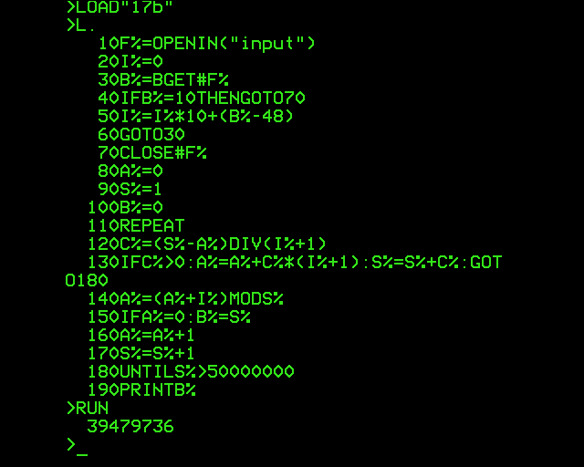

# [Day 17](http://adventofcode.com/2017/day/17) in BBC BASIC

I'm going to do something a bit special today. My first ever computer was the
BBC Micro (Model B), powered by BBC BASIC. The machine had 32 kB of RAM and ran
at 2 MHz. Which, I figured, should be enough to get through today's puzzle!
Part one, at least…

Unfortunately, my Beeb died on me a few years ago, so I'm going to be using an
emulator today. I installed the Linux port of BeebEm and tried to type `*.` (an
abbreviation for `*CAT`) to see if there was an emulated disk in the drive. But
apparently, BeebEm for Unix doesn't map the keyboard as nicely as the Windows
version, so it came out as `(.`. Eventually I found the `*` character under the
`'` key (which, to complicate matters further, is actually the `Q` key on my
keyboard because it's set to dvorak layout).

As a language reference, I'm using
[bbcbasic.co.uk](http://www.bbcbasic.co.uk/). It's actually a Windows
reimplementation of the language, but it should be close enough. I'm also using
[Rosetta Code](http://rosettacode.org/wiki/Category:BBC_BASIC).

I do try to stick to the rules, so I should either read the input from "stdin"
(the keyboard, because no input redirection exists on this OS), or from a file
named `input`. Typing the input (359) for each test run is both tedious and
overly simple, so I'll read from a file instead. But it must be a plain-text
ASCII file. I created it like this:

    >F%=OPENOUT("input")
    >PRINT#F%,"359"
    >CLOSE#F%
    >*TYPE"input"
    953

Huh? Well, it seems strings are stored backwards in a file, but reading them
back works fine:

    >F%=OPENIN("input")
    >INPUT#F%,A$
    >CLOSE#F%
    >PRINTA$
    359

There might be an invisible length byte preceding it as well. To write a string
verbatim, followed by a newline (ASCII 10), we need `BPUT#` instead:

    >F%=OPENOUT("input")
    >BPUT#F%,"359"

    Type mismatch
    >_

Hmm, seems that BBC BASIC for Windows isn't quite the same as the real thing
after all.
[Here](http://central.kaserver5.org/Kasoft/Typeset/BBC/Contents.html) is what
seems to be a transcript of the official BBC Micro User Guide, which should be
the canonical reference, and it makes no mention of `BGET#` supporting strings.
So let's do it by hand:

    >BPUT#F%,51
    >BPUT#F%,53
    >BPUT#F%,57
    >BPUT#F%,10

Next up: write code to read this file and parse the bytes back into an integer.
Notes at the end of the line are just for this README and not part of the
program, of course.

    >10F%=OPENIN("input")  Open the input file.
    >20I%=0                Our step number I% (for "input") starts at zero.
    >30B%=BGET#F%            Read a byte into B%.
    >40IFB%=10THENGOTO70     If it's a newline, break out of the loop.
    >50I%=I%*10+(B%-48)      Shift all digits left (*10) and add the last digit.
    >60GOTO30              And repeat.
    >70CLOSE#F%            Close the file.
    >RUN
    >PRINTI%
           359

By prefixing a statement with a line number, it becomes part of your program
instead of being executed immediately. Note how spaces are entirely optional.
Also note the use of `GOTO`: the `break` statement doesn't exist here. Integer
variables can be suffixed with `%`, which makes them a bit faster and
memory-efficient.

On to the actual puzzle. Arrays need to be dimensioned up front, so we just
create one that's big enough and keep track of how many elements are used.
Arrays are zero-indexed, but they include the upper bound, so `DIMB%(2017)`
actually gives us a 2018-element array, just as we need. To find the next
index, of course we use the `MOD` operator instead of stepping 359 times.

    80DIMB%(2017)            B% is the circular buffer.
    90A%=0                   A% is our current index.
    100FORS%=1TO2017         For each number in the range 1...2017:
    110A%=((A%+I%)MODS%)+1     Find the next insertion point.
    120FORJ%=S%TOA%+1STEP-1    \
    130B%(J%)=B%(J%-1)          | Shift all subsequent elements up.
    140NEXTJ%                  /
    150B%(A%)=S%               Put the next element into place.
    160NEXTS%                And repeat.
    170PRINTB%((A%+1)MODS%)  Finally, print the answer.

This being a quadratic-time algorithm due to the slow insertions, it would have
taken a while to run on a real Beeb. Fortunately, I can crank up the emulator
speed to 100×; I don't know if it achieves that, but it did make the program
finish in under a minute and produce the right answer:

I wonder if a linked list would be more efficient: on the one hand, insertions
are constant-time, but on the other hand, we'd need to traverse half the list
on average to find the next insertion point. The big-O doesn't care, but the
machine might. Cache efficiency wasn't really a thing yet, and maybe memory
reads are faster than writes so the read-heavy linked list implementation comes
out ahead of the write-heavy?

---

Second part: yikes! There's no way we're going to fit 50 million items in 32
kB. So I'm going to have to get clever. It's easy enough to keep track of the
place where 0 ends up – in fact, insertions always happen after it, so 0 will
remain at position 0. So all we need to do is track which value comes after it
during each of the 50000000 steps, and hope that they can be simulated fast
enough. For reference: the array-based implementation probably did about 2000 ×
2000 × ½ × ½ = 1 million operations, but each operation was more complex.

Can we improve even further? After all, most insertions won't happen anywhere
near 0. Can we predict when the current pointer will land at 0, and only handle
those cases? Not easily, I think: the denominator of the modulo operation
changes each step. But we do know that at most times, the buffer is going to be
much bigger than 359, so we can skip a good number of iterations by jumping
ahead by the largest possible integer multiple of 359. This should make the
algorithm fast enough even for this early '80s machine.

    80A%=0                 A% is again our current index.
    90S%=1                 S% is the next value to insert.
    100B%=0                B% is the value after 0 in the buffer.
    110REPEAT              Start the loop.
    120C%=(S%-A%)DIV(I%+1)   C% indicates how many times we can step ahead
                             before we get close to the end. (The end shifts
                             in the meantime, so this could happen more than
                             once in a row.)
    130IFC%>0:A%=A%+C%*(I%+1):S%=S%+C%:GOTO180
                             If we can skip ahead: do it, and proceed with the
                             next loop iteration.
    140A%+(A%+I%)MODS%       We couldn't skip ahead, so wrap around.
    150IFA%=0:B%=S%          If we insert after the 0: save this value.
    160A%=A%+1               Increment current index.
    170S%=S%+1               Increment value to be inserted.
    180UNTILS%>50000000    Loop until we've inserted 50000000 values.
    190PRINTB%             Print the answer!

In fact, it was more than fast enough: it ran even faster than the first
part, _and_ produced the right answer. Victory!

